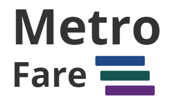
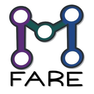

  

> ### React codebase containing a [map](https://www.openstreetmap.org/) for route navigation of Mass Transit System in Bangkok, Thailand (BTS, MRT, Airport Rail Link, etc).

## What is it?
It is a software application for route navigation of Mass Transit System in Bangkok, Thailand (BTS, MRT, Airport Rail Link, etc)

## Getting started

You can view a live demo over at https://metrofare.netlify.app/

To get the application running locally:

- Clone this repo
- `yarn install` to install all req'd dependencies
- `yarn start` to start the local server (this project uses create-react-app)
- `yarn test` to run the tests
- `yarn test:coverage` to run the tests with test coverage result

## Functionality overview

The application is a Thailand, specifically Bangkok, mass transit system map called "Metro Fare". It uses openstreetmap to show the map and uses graph theory to find the paths from 2 different stations

This project is also focus on testing which contains fare amount of tests that you can follow this test practices for learning purposes

## Development
see more in [contributing/development.md](contributing/development.md)